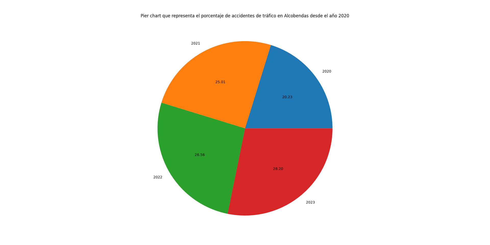
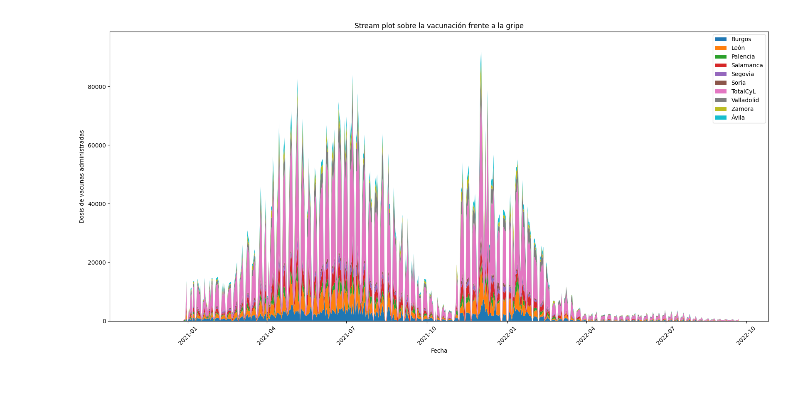

# PEC2_Visualización_de_datos
Repositorio para publicar los diferentes resultados obtenidos a través del análisis de los tres datasets analizados para esta PEC.

La siguiente práctica se basa en la creación de diferentes códigos de Python con el fin de representar tres técnicas específicas de visualización de datos:

De este modo, el objetivo de esta práctica consta en desarrollar un conjunto de scripts de Python, que permita resolver diferentes cuestiones que se irán abordando. Para la realización
del código que se organiza de manera lógica separando por diferentes archivos planos .py por ejercicios de tal modo que existen un total de **3 archivos planos**

- Primera_tecnica.py

- Segunda_tecnica.py

- Tercera_tecnica.py

Cada uno de estos archivos planos consta de diferentes líneas de código que permiten analizar el conjunto de datos, hacer una primera base de preprocesador y finalmente la obtención del gráfico.

La idea de esta estructura es debido a que se puede ejecutar el código a través de un IDE como Spyder o cualquier otro entorno que permita la lectura de ficheros planos de python **.py**

# Distribución del proyecto

En el proyecto se encuentran un total de 5 carpetas y dos ficheros *LICENSE* y *README*

- La primera carpeta se llama *Primera-tecnica*, dentro de ella se encontrará tanto el fichero de ejecución del gráfico como la carpeta *data* con el fichero CSV de los datos obtenidos.

- La segunda carpeta se llama *Segunda-tecnica*, dentro de ella se encontrará nuevamente el fichero de ejecución del segundo gráfico y la carpeta *data* con los datos necesarios.

- La tercera carpeta se llama *tercera-tecnica*, en la que se encontrará el fichero de ejecución del tercer gráfico y la carpeta *data* con el último dataset obtenido para el proyecto.

- La cuarta carpeta se llama *Figuras*, en ella se encontrarán en formato **.PNG** las diferentes visualizaciones obtenidas.

-  La quinta carpeta se llama *Referencias*, en el que se sitúan todas las referencias empleadas a lo largo de la PEC.

Y finalmente los ficheros:

- LICENCIA, con la documentación obtenida de referencia

- README, con la información necesaria del proyecto

# Procedimiento para EJECUTAR LOS DIFERENTES CÓDIGOS

1- Descargar y descomprimir el proyecto

2- Abrir un IDE como *Spyder* que permita la ejecución de ficheros planos

3- Opcional (crear un entorno virtual para ejecutar el código mediante los comandos)

4- Instalar las tres librerías necesarias para la realización de los gráficos:

	pip install numpy
 	pip install pandas
  	pip install matplotlib.pyplot

5- Finalmente, ejecutar el código principal

**IMPORTANTE**

Si se usa el IDE *Spyder* recuerde modificar el path donde se encuentra el fichero de datos necesario para la creación del gráfico y es posible que se requiera de dos contra barras para indicar un cambio de carpeta.
						
Ejemplo:

	*"c:\\Users\\mvinesr\\Escritorio\\Priemra_tecnica.csv"*

# OUTPUTS
**PRIMERA TÉCNICA**

- Tras ejecutar el primer código llamado *primera_tecnica.py*, se mostrará por el primer gráfico realizado él el cual se conoce como Pie Chart y en el que se muestra en porcentaje, el número de accidentes que ha habido en Alcobendas en cada año desde 2020 hasta 2023. Es un gráfico simple pero extremadamente útil que permite observar como con el paso de los años, **existe un incremento en el número de accidentes de tráfico**.

**SEGUNDA TÉCNICA**

- El segundo código llamado *segunda_tecnica.py*, permite mostrar en un stream plot la evolución en el tiempo de la administración de dosis de vacunas contra la gripe administradas sobre distintas provincias de la región de Castilla y León. Esta visualización permite identificar patrones de vacunación como picos y disminuciones en el número de dosis administradas. En concreto el siguiente gráfico permitiría reflejar indirectamente la influencia que tuvo la pandemia por el COVID-19, especialmente en *2021* y en *2022*. Es possible que durante ese período de máximo apogeo del COVID, hubiese una mayor concienciación pública sobre la vacunación en general y en concreto de a gripe. Lo que supondría un incremento notable en las dosis administradas.

**TERCERA TÉCNICA**

- Por último, el código *tercera_tecnica.py*, permite mostrar en una visualización más avanzada, en concreto, se trata de un *Horizon graph*, el cual permite representar por continentes y en un periodo comprendido entre 2019 y 2023 el gasto medio de cada continente. Este gráfico que tiene una cobertura temporal más amplia, permite ver nuevamente y de manera indirecta, la influencia que tuvo la pandemia sobre los diferentes continentes. Este gráfico que se establece mediante un gradiente de colores de diferentes intensidades, donde tonos azules indican valores positivos y tonos rojos, valores negativos, permite ver como en el período de 2020 hasta finales de 2021, todos los continentes sufrieron un incremento notable en los gastos medios.

# Copyright, información de los datos y Licencias

- Copyright © 2001-2024 Python Software Foundation.

Consulte la LICENCIA para obtener información sobre el historial de este software.

Esta distribución de Python contiene código de Licencia Pública General (GPL) de GNU.

- Link de descarga de los datos (se encuentra de manera adicional en la Bibliografía):
  	- https://datos.gob.es/es/catalogo/l01280066-accidentes-de-trafico-en-alcobendas-desde-el-ano-2020
  	- https://datos.gob.es/es/catalogo/a07002862-vacunacion-frente-a-la-gripe-por-edad-sexo-y-provincia-campana-24-25
  	- https://datos.gob.es/es/catalogo/ea0010587-distribucion-del-gasto-turistico-y-gasto-medio-diario-realizado-segun-continente-de-destino-gdre-identificador-api-58709

- Licencias de las diferentes fuentes de datos obtenidas:

  	- http://www.opendefinition.org/licenses/odc-by
  	- https://www.ine.es/aviso_legal
  	- https://creativecommons.org/licenses/by/4.0/deed.es_ES
	
		 
		 
		 

